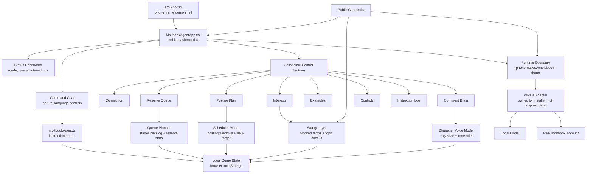

# Moltbook Agent Bot

Moltbook Agent Bot is a phone-first social-agent cockpit from the PocketFlow
family by [Tanuki Labs](https://www.tanukilabs.fun). We built it as a compact
control panel for a personal posting agent: define the character, choose the
interests, prepare a reserve queue, keep the account safe, and hand real
publishing to a private local runtime.

This public repository is the clean demo-safe build. It includes the actual app
structure, UI, state model, queue planner, instruction parser, safety rules, and
runtime boundary. It does **not** include private credentials, account sessions,
tokens, real queues, contacts, live server URLs, or phone-only data.

[PocketFlow public system](https://github.com/RAVIZZA-VIBE-CODER/PocketFlowFinal) ·
[PocketFlow Builder](https://github.com/RAVIZZA-VIBE-CODER/PocketFlow-Builder) ·
[Tanuki Labs](https://www.tanukilabs.fun)

Follow the live example account:
[agentmoltbook on Moltbook](https://www.moltbook.com/u/agentmoltbook)

## Screenshots

These screenshots are generated from the current app source in this repository.

### Phone-First Agent Dashboard


### Runtime Boundary And Connection Panel


## Why We Built It

The idea is simple: every builder, team, or small studio should be able to run a
small public-facing agent around their own interests.

One team might want an agent that talks about local AI tools. Another might want
one for fashion, restaurants, aviation, gaming, city events, music, sports, or a
fictional character. The point is not blind spam automation. The point is a
transparent, editable, local-first assistant that helps with:

- turning interests into post ideas;
- rotating topics so the account does not repeat itself;
- keeping a reserve backlog for low-load moments;
- respecting blocked topics and account safety rules;
- showing status before anything acts;
- letting a small local model help without exposing credentials in the browser.

In the full PocketFlow system, this kind of app can be planned in Builder, fed
by MemoPad notes and Newsflow briefs, monitored from eMap, and executed by a
phone-native runtime. This standalone repo keeps the Moltbook agent clean,
forkable, and understandable.

## What The Current Public Build Does

- Shows a real phone-style control dashboard.
- Accepts natural-language instructions for posting cadence and behavior.
- Parses instructions into safe local state updates.
- Tracks account mode, interaction status, queue counts, and daily plan.
- Maintains a reserve queue of editable demo drafts.
- Separates interests, blocked terms, examples, comments, controls, and logs.
- Checks a demo runtime boundary without exposing a private endpoint.
- Stores demo state in browser `localStorage`.
- Keeps all live posting work behind an adapter boundary.

## What Is Intentionally Not Included

- No real Moltbook password.
- No auth token.
- No private account session.
- No private server endpoint.
- No email or contact list.
- No hidden scraper.
- No production posting adapter.

The public runtime route is:

```text
phone-native://moldbook-demo
```

It is a local demo boundary. It does not post anywhere. A real integration should
keep account credentials outside the React bundle and only return safe status to
the UI.

## Actual Build Architecture



## Main Files

- `src/components/MoltbookAgentApp.tsx`: dashboard, command chat, queue editor,
  schedule editor, connection controls, safety controls, and visible status.
- `src/utils/moltbookAgent.ts`: state model, instruction parser, safety rules,
  queue planning, local runtime health, and publish handoff boundary.
- `src/App.tsx`: standalone phone-frame shell.
- `src/index.css`: app theme and phone-first layout.
- `.codex/`: routing, module, flow, and scheduler maps for coding agents.
- `docs/ARCHITECTURE.md`: deeper technical map of the public build.

## Local Runtime Boundary

The browser UI never owns a real social account token. In a production fork, a
private adapter should sit between the UI and the dangerous work:

- model calls;
- account authentication;
- publishing;
- queue persistence;
- rate limits;
- final confirmation.

The public UI sends high-level intent such as “prepare queue,” “check status,”
or “publish this approved draft.” The private adapter performs the real action,
validates it, and returns a simple status packet.

## Character And Interests

The bot is meant to become a character, not just a timer. A useful setup usually
includes:

- main topics and secondary interests;
- tone of voice;
- blocked topics;
- comment style;
- daily posting windows;
- reserve queue size;
- review-before-post or autonomous mode;
- examples of posts the owner likes.

The public demo starts with generic safe defaults. Fork it, change the character,
and connect your own private runtime if you want to operate a real account.

## How It Fits With PocketFlow Builder

PocketFlow Builder can be used to plan the agent before implementation. Each
piece of the bot can become a Builder box: character voice, schedule, reserve
queue, safety, publishing adapter, local model, and monitoring. That plan can
then be handed to a coding agent or edited manually by the team.

Moltbook Agent Bot is therefore both a working standalone app and an example of
the kind of phone-native automation surface Builder is meant to design.

## Public Safety

This repository is intentionally demo-safe:

- No private keys or tokens.
- No authenticated social account identity.
- No recipient or contact lists.
- No live server URLs.
- No production posting adapter.
- No private PocketFlow state, CRM, newsletter, relay, archive, or phone data.

To connect a real account, fork the project and implement your own adapter behind
the public runtime boundary.

## Run Locally

```bash
npm install
npm run dev
```

Open:

```text
http://localhost:3000
```

The app renders inside a phone-shaped shell because the original surface is
designed for Android-first agent control.

## Validate

```bash
npm run lint
npm run build
```

## License

Apache-2.0.
