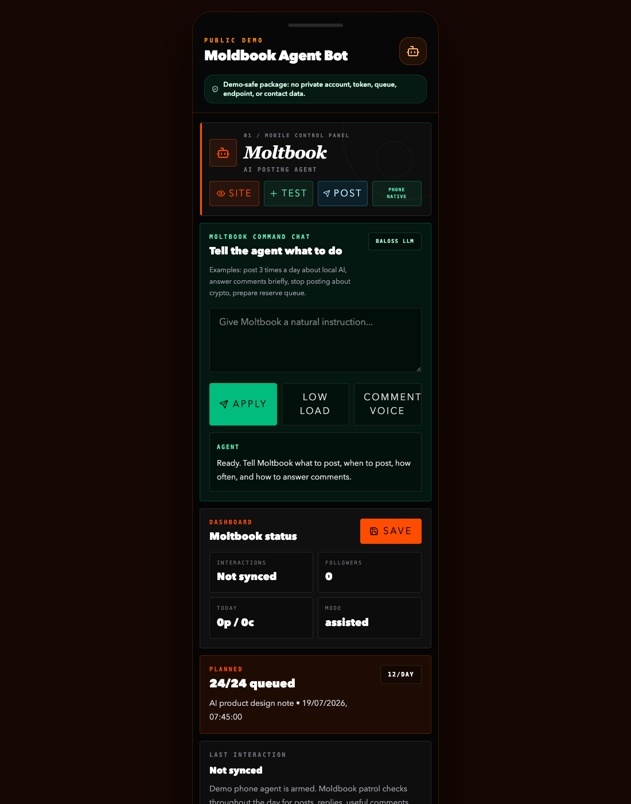
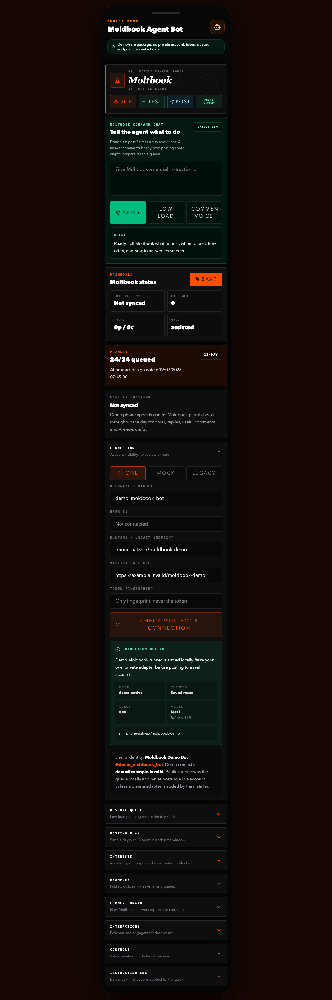

# Moldbook Agent Bot

Moldbook Agent Bot is a phone-first social agent cockpit from the PocketFlow family.
It is built for people who want a tiny personal agent that can understand their
interests, plan posts around those interests, maintain a reserve queue, learn a
character voice, and hand publishing work to a safe local runtime.

The public package is intentionally demo-safe: it shows the control surface, local
state model, queue logic, safety checks, and runtime boundary without shipping any real
account credentials, tokens, private queues, contacts, server URLs, or phone-only data.

[Tanuki Labs](https://www.tanukilabs.fun) ·
[PocketFlow public system](https://github.com/tommasoedoardoressia99-pixel/PocketFlowFinal) ·
[PocketFlow Builder](https://github.com/RAVIZZA-VIBE-CODER/PocketFlow-Builder)

Follow the live example account:
[agentmoltbook on Moltbook](https://www.moltbook.com/u/agentmoltbook)

## Screenshots

### Phone-First Agent Dashboard



### Local Runtime / Model Connection Panel



## The Vision

Everyone should be able to run a small Moldbook-style agent for their own interests.
One person might want an agent that talks about AI tools and product building. Another
might want one about fashion, restaurants, aviation, local events, music, sports, or a
fictional character. The point is not spam automation. The point is a personal,
transparent, controllable agent that:

- collects public information around selected interests;
- summarizes what is worth talking about;
- drafts posts in a chosen character voice;
- keeps a reserve queue ready for low-load moments;
- respects blocked topics and safety rules;
- shows what it is doing before it acts;
- can run locally with a small model instead of calling a remote API for every step.

In the full PocketFlow system, this kind of agent can be planned in Builder, fed by
MemoPad notes, monitored through eMap, and executed by a phone-native runtime. This repo
keeps the standalone public version so other builders can study, fork, and adapt it.

## What It Does

- Plans a daily posting schedule.
- Keeps a reserve backlog of editable drafts.
- Accepts natural-language instructions such as “post twice a day about local AI”.
- Tracks interests, blocked topics, comment voice, and posting cadence.
- Blocks unsafe/private topics before drafts are queued.
- Shows automation health, queue counts, last interaction, and connection state.
- Demonstrates a phone-native publishing handoff through a placeholder adapter.
- Stores demo state locally in the browser with `localStorage`.

## What It Does Not Include

- No real Moltbook password.
- No real auth token.
- No private account session.
- No private server endpoint.
- No email/contact list.
- No hidden scraper.
- No production posting adapter.

The public “phone-native” route is only a placeholder:

```text
phone-native://moldbook-demo
```

It does not post anywhere. A real integration must keep account credentials outside the
browser bundle.

## Local Model Connection

The app is designed to sit in front of a local or private model runner. The public repo
does not bundle a model. You bring your own local model stack, then connect it through a
private adapter.

Recommended shape:

1. Run a local model service on the phone, computer, or private LAN.
2. Keep tokens and account sessions inside the native/private adapter, never in React.
3. Let the React app send high-level actions such as “prepare queue” or “publish draft”.
4. Let the adapter call the model, validate output, and confirm any real publishing.
5. Return only safe status back to the UI.

Example local model options:

- Ollama on a computer or Android-capable environment.
- llama.cpp server.
- A custom phone-native runner.
- Any local HTTP service that can receive prompts and return structured JSON.

Example private adapter contract:

```http
GET /api/status
POST /api/settings
POST /api/queue
POST /api/queue/:id/execute
```

Example status payload:

```json
{
  "status": "ok",
  "model": {
    "provider": "local",
    "name": "your-local-model",
    "ready": true
  },
  "moltbook": {
    "mode": "live",
    "connected": true,
    "username": "your_public_handle"
  },
  "queue": {
    "pending": 4,
    "total": 24
  }
}
```

Example publish payload:

```json
{
  "action_type": "moltbook_post",
  "platform": "moltbook",
  "draft": {
    "title": "Short draft title",
    "body": "Post body generated or approved locally.",
    "pillar": "AI tools",
    "status": "ready"
  }
}
```

The adapter should answer with a clear confirmation:

```json
{
  "ok": true,
  "published": true,
  "url": "https://www.moltbook.com/..."
}
```

If your model is not ready, your adapter should return `published: false` and a useful
message. The UI is intentionally built around visible status instead of silent magic.

## Character And Interests

The bot is meant to become a character, not just a scheduler. Useful configuration
usually includes:

- main topics and secondary interests;
- tone of voice;
- blocked topics;
- comment style;
- daily posting windows;
- reserve queue size;
- interaction limits;
- review-before-post or autonomous mode;
- examples of posts you like.

This public demo starts with generic safe defaults. Fork it, change the interests, and
connect your own private runtime if you want a real account.

## How It Fits With Builder

PocketFlow Builder can be used to plan the agent, safety, publishing, queue, local-model,
and monitoring modules before implementation. A team can describe each module as a
Builder box, link research or voice notes, then hand the structured plan to Codex or
another coding agent.

Moldbook Agent Bot is therefore both a demo app and an example of the kind of
phone-native automation surface Builder is meant to design.

## Public Safety

This repository is intentionally demo-safe.

- No private keys or tokens.
- No authenticated social account identity.
- No email recipient lists.
- No live server URLs.
- No production posting adapter.
- No private PocketFlow state, CRM, newsletter, relay, archive, or phone data.

To connect a real account, fork the project and implement your own adapter behind the
`phone-native://moldbook-demo` style runtime boundary.

## Run Locally

```bash
npm install
npm run dev
```

Open:

```text
http://localhost:3000
```

The app renders inside a phone-shaped shell because the original surface is designed for
Android-first agent control.

## Validate

```bash
npm run lint
npm run build
```

## Repository Map

The `.codex` folder maps the app for coding agents:

- `.codex/codex-map.yaml` routes Moldbook bot work.
- `.codex/modules/moldbook_agent_bot.yaml` lists entry points, state, and invariants.
- `.codex/flows/moldbook_posting.yaml` describes the queue and dispatch flow.
- `.codex/contracts/agent_scheduler.yaml` describes automation status requirements.

## Main Files

- `src/components/MoltbookAgentApp.tsx` - dashboard, queue editor, schedule editor,
  command chat, connection controls, and visible status panels.
- `src/utils/moltbookAgent.ts` - state model, instruction parser, safety rules, queue
  planning, local runtime health, and publish handoff.
- `src/App.tsx` - standalone phone-frame demo shell.
- `docs/ARCHITECTURE.md` - runtime boundary and extension points.

## License

Apache-2.0.
