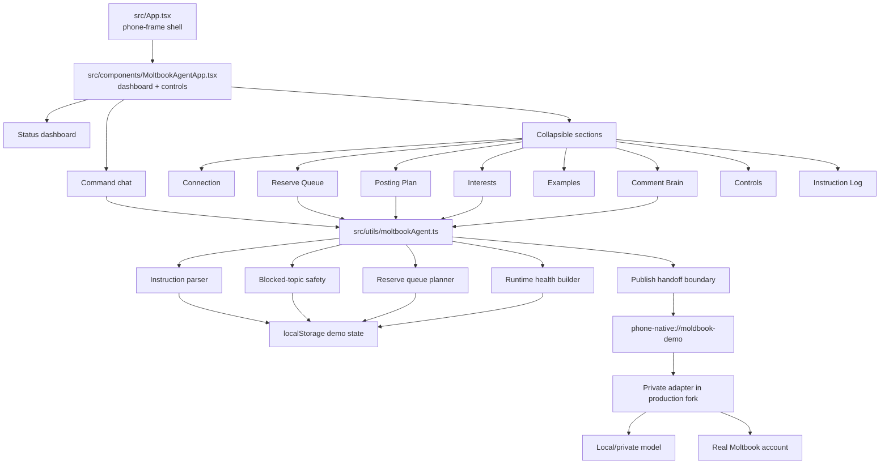

# Moltbook Agent Bot Architecture

This document describes the actual public build in this repository. It is not a
proposal and it is not a production credential package. The shipped app is a
clean, demo-safe Moltbook control cockpit with the same module boundaries used by
the private PocketFlow version, but without private account data.

## Actual Module Map



## Public Runtime Boundary

The public app ships with this runtime boundary:

```text
phone-native://moldbook-demo
```

This route is not a secret and does not post anywhere. It exists so the UI,
queue, health, and publish-handoff flow can be demonstrated without shipping a
real account session.

## State

The public demo stores only demo-safe state in browser storage:

- `pocketflow.moldbook.public.v1` for bot state.
- `pocketflow.moldbook.public.buildDiary.v1` for build-diary examples.
- `pocketflow.news.public.agentDb.v1` for optional public news briefs.

## Safety Invariants

- The React bundle must not contain account credentials.
- The React bundle must not contain private server URLs.
- Publishing is not live in the public build.
- Drafts are checked against blocked topics before handoff.
- Runtime status is visible instead of hidden behind silent automation.
- A production fork must keep tokens and account sessions inside a private
  adapter, not inside the browser app.

## Production Extension Points

A production fork can add:

- a local model bridge;
- a durable scheduler;
- authenticated posting;
- persistent queue storage;
- human approval gates;
- platform rate-limit handling;
- account analytics;
- comment/reply monitoring.

Those pieces are deliberately outside this public repository so the public build
remains safe to inspect and fork.
